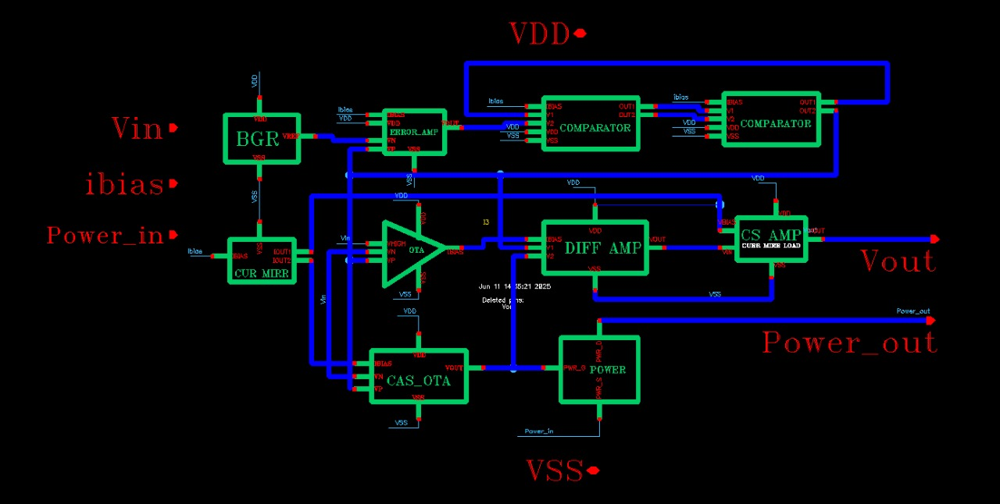

# ⚡ Mixed-Signal IC Layout for Adaptive Biasing & Power Management

A compact, reusable mixed-signal analog IP designed for **low-power applications** using the GPDK 90nm CMOS process.  
This project integrates essential analog building blocks such as **Bandgap Reference, OTAs, Error Amplifiers, Comparators, and Flash ADC** with digital feedback.

---

## 📂 Table of Contents
- [Overview](#overview)
- [Key Features](#key-features)
- [Architecture](#architecture)
- [Performance](#performance)
- [Schematics](#schematics)
- [Layouts](#layouts)
- [Results](#results)
- [Contributing](#contributing)
- [License](#license)

---

## 📖 Overview
This project demonstrates the design and layout of a **mixed-signal IC** optimized for low-power operation.  
It highlights **adaptive biasing techniques** and **block-level modularity** for reusability in VLSI design.

---

## ✨ Key Features
- 🔋 Low-power operation (IQ: 15–30 µW)
- 📐 Layout reusability & modularity
- ⚡ Integrated Bandgap Reference
- 🎛 Signal Conditioning Front-End
- 📊 Flash ADC with Digital Feedback
- ✅ Post-layout verified performance

---

## 🏛 Architecture

---

## 📊 Performance
| Parameter              | Value                  |
|------------------------|------------------------|
| Supply Voltage         | 1.8 V                 |
| Load Current Range     | 0–10 mA               |
| Quiescent Current (IQ) | 15–30 µW              |
| Transient Overshoot    | < 50 mV               |
| Line Regulation        | < 1%                  |
| Load Regulation        | < 2%                  |
| ADC Resolution         | 3-bit (8:1 Flash ADC) |
| Efficiency @ 10 mA     | 85–88%                |
| Operating Temperature  | -5°C to 90°C (sim.)   |

---

## 📐 Schematics
### Bandgap Reference & Amplifiers

---

## 🖼 Layouts
### Full Chip Layout

---

## 📈 Results
### Line Regulation (FF, -20 °C)

### Load Regulation (TT, 1.8 V, 27 °C)

---

## 🤝 Contributing
Contributions are welcome!  
Fork the repo, make improvements, and submit a pull request.

---

## 📜 License
This project is licensed under the MIT License.  
See the LICENSE file for details.
